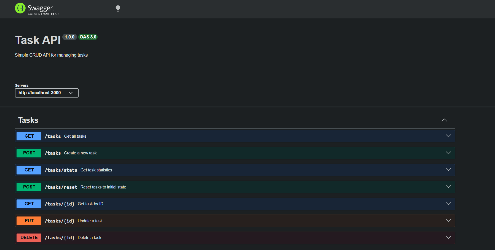
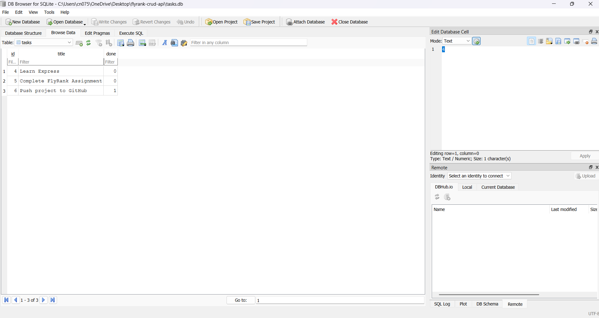

# FlyRank CRUD API

A RESTful CRUD API built with Node.js, Express, PostgreSQL, and Docker Compose.

## Run the Project

```bash
git clone https://github.com/nareshchandu17/flyrank-crud-api.git
cd flyrank-crud-api
cp .env.example .env
docker compose up
```

> Windows users: copy `.env.example` to `.env` manually instead of using `cp`.

That's it. Docker starts both the API and the PostgreSQL database. No manual database setup needed.

## Environment Variables

Copy `.env.example` to `.env`:

```
DATABASE_URL=postgres://flyrank:flyrank123@db:5432/flyrank_db
PORT=3000
```

> When running outside Docker (e.g. `npm run dev`), change the host from `db` to `localhost` and the port to `5433`.

## Tech Stack

- Node.js
- Express.js
- PostgreSQL (via pg)
- Docker + Docker Compose
- Swagger UI

## API Endpoints

| Method | Endpoint       | Description              |
|--------|----------------|--------------------------|
| GET    | /              | API info                 |
| GET    | /health        | Health check             |
| GET    | /tasks         | Get all tasks            |
| GET    | /tasks/:id     | Get one task             |
| POST   | /tasks         | Create a task            |
| PUT    | /tasks/:id     | Update a task            |
| DELETE | /tasks/:id     | Delete a task            |
| GET    | /tasks/stats   | Task statistics          |

## Example Requests

Get all tasks:
```bash
curl -i http://localhost:3000/tasks
```

Create a task:
```bash
curl -i -X POST http://localhost:3000/tasks \
  -H "Content-Type: application/json" \
  -d "{\"title\":\"Learn Docker\"}"
```

## Swagger Docs

Visit: http://localhost:3000/docs



## Database

PostgreSQL is managed by Docker Compose. The table is created automatically on first run and seeded with three sample tasks if empty:

| id | title                      | done  |
|----|----------------------------|-------|
| 1  | Learn Express              | false |
| 2  | Complete FlyRank Assignment| false |
| 3  | Push project to GitHub     | true  |

Data is stored in a Docker volume (`taskdata`) and survives `docker compose down` / `docker compose up` cycles.

## Database Screenshot



> Screenshot taken from psql / pgAdmin showing the `tasks` table with seeded data.

## Example SQL Query

```sql
SELECT * FROM tasks;
```

Returns every task stored in PostgreSQL.

---

# Assessment History

| Assessment | Description                        | Status |
|------------|------------------------------------|--------|
| 1          | In-memory CRUD API                 | ✅     |
| 2          | SQLite persistent storage          | ✅     |
| 3          | PostgreSQL + Docker                | ✅     |

---

# AI vs Me

## AI Prompt

```
Build a RESTful Task Management API using Node.js and Express.

Requirements:

- Use Express.js.
- Store tasks in memory using a JavaScript array (no database).
- Implement CRUD operations.

Endpoints:

GET /
Return API information.

GET /health
Return { "status": "ok" }

GET /tasks
Return all tasks.

GET /tasks/:id
Return a single task by id.
Return 404 if the task does not exist.

POST /tasks
Accept JSON:

{
  "title": "Buy milk"
}

Validate that title is provided and is not empty.
Return 400 for invalid input.
Create a new task with:
- auto-incrementing id
- done = false
Return status 201 and the created task.

PUT /tasks/:id
Allow updating title and done.
Return 404 for unknown ids.
Return 400 for invalid data.

DELETE /tasks/:id
Delete the task.
Return 204 on success.
Return 404 if the task doesn't exist.

Use proper HTTP status codes.

Organize the project using:
- controllers
- routes
- app.js
- server.js

Use Swagger UI for API documentation.

Provide complete code with comments.
```

---

## What AI Did Better

- Added a Task schema definition in Swagger components for better API documentation
- Used consistent JSDoc comments throughout the code
- Clean separation of concerns with proper MVC structure
- Used `/api-docs` endpoint which is a common convention for Swagger
- Included helpful comments explaining each function

---

## What AI Got Wrong

- **No initial data**: AI started with an empty tasks array, while my implementation includes 3 initial tasks for testing
- **ID generation approach**: AI uses a simple counter (`currentId++`) which could cause issues if tasks are deleted. My implementation calculates the next ID based on the highest existing ID using `getNextId()`
- **Missing features**: AI didn't implement the optional extras (filtering, search, stats, reset) that I added
- **Error response format**: AI uses `"message"` key for errors, while I use `"error"` key - both are valid but inconsistent
- **Update validation**: AI doesn't check if the user is trying to update without providing any data, my implementation returns 400 for "Nothing to update"
- **Data separation**: AI stores tasks directly in the controller file, while I separated data into a dedicated `data/tasks.js` file for better organization

---

## What My Prompt Missed

I didn't specify:
- Whether to include initial seed data
- The exact ID generation strategy (counter vs. max existing ID)
- The error response format (message vs error key)
- Whether to implement optional features like filtering and search
- Whether to separate data into its own file

---

## Comparison Summary

| Aspect             | My Implementation           | AI Implementation      |
|--------------------|-----------------------------|------------------------|
| Initial Data       | 3 seed tasks                | Empty array            |
| ID Generation      | Based on max existing ID    | Simple counter         |
| Data Storage       | Separate data file          | In controller          |
| Filtering          | ✅ ?done=true/false         | ❌                     |
| Search             | ✅ ?search=query            | ❌                     |
| Stats Endpoint     | ✅ /tasks/stats             | ❌                     |
| Reset Endpoint     | ✅ /tasks/reset             | ❌                     |
| Error Key          | `"error"`                   | `"message"`            |
| Update Validation  | Checks for empty update     | No check               |
| Swagger Schema     | Basic                       | Includes Task schema   |
| Swagger Path       | /docs                       | /api-docs              |

---

## Improved Prompt

Based on this comparison, an improved prompt would include:

```
Build a RESTful Task Management API using Node.js and Express.

Requirements:

- Use Express.js.
- Store tasks in memory using a JavaScript array (no database).
- Include 3 initial seed tasks for testing.
- Implement CRUD operations.

ID Generation:
- Calculate next ID based on the highest existing ID (not a simple counter)
- This handles task deletion correctly

Endpoints:

GET /
Return API information including name, version, and available endpoints.

GET /health
Return { "status": "ok" }

GET /tasks
Return all tasks.
Support query parameters:
- ?done=true - filter completed tasks
- ?done=false - filter incomplete tasks
- ?search=query - search by title (case-insensitive)

GET /tasks/:id
Return a single task by id.
Return 404 with { "error": "Task {id} not found" } if not found.

POST /tasks
Accept JSON: { "title": "Buy milk" }
Validate that title is provided and is not empty.
Return 400 with { "error": "Title is required" } for invalid input.
Create a new task with auto-incrementing id and done=false.
Return status 201 and the created task.

PUT /tasks/:id
Allow updating title and done.
Return 404 with { "error": "Task {id} not found" } for unknown ids.
Return 400 with { "error": "Nothing to update" } if no data provided.
Return 400 with { "error": "Title cannot be empty" } for empty title.
Return 400 with { "error": "Done must be true or false" } for invalid done value.

DELETE /tasks/:id
Delete the task.
Return 204 on success.
Return 404 with { "error": "Task {id} not found" } if not found.

GET /tasks/stats
Return { total, done, open } statistics.

POST /tasks/reset
Reset tasks to initial seed data.

Use proper HTTP status codes (200, 201, 204, 400, 404).
Use "error" key in error responses.

Organize the project using:
- data/ folder for initial data
- controllers/ folder
- routes/ folder
- swagger/ folder
- app.js
- server.js

Use Swagger UI at /docs endpoint with Task schema definition.
```

---

## Running the AI Version

The AI-generated version is in the `ai-version/` folder:

```bash
cd ai-version
npm install
npm run dev
```

It runs on port 3001 to avoid conflict with the main implementation (port 3000).

Swagger docs: http://localhost:3001/api-docs
