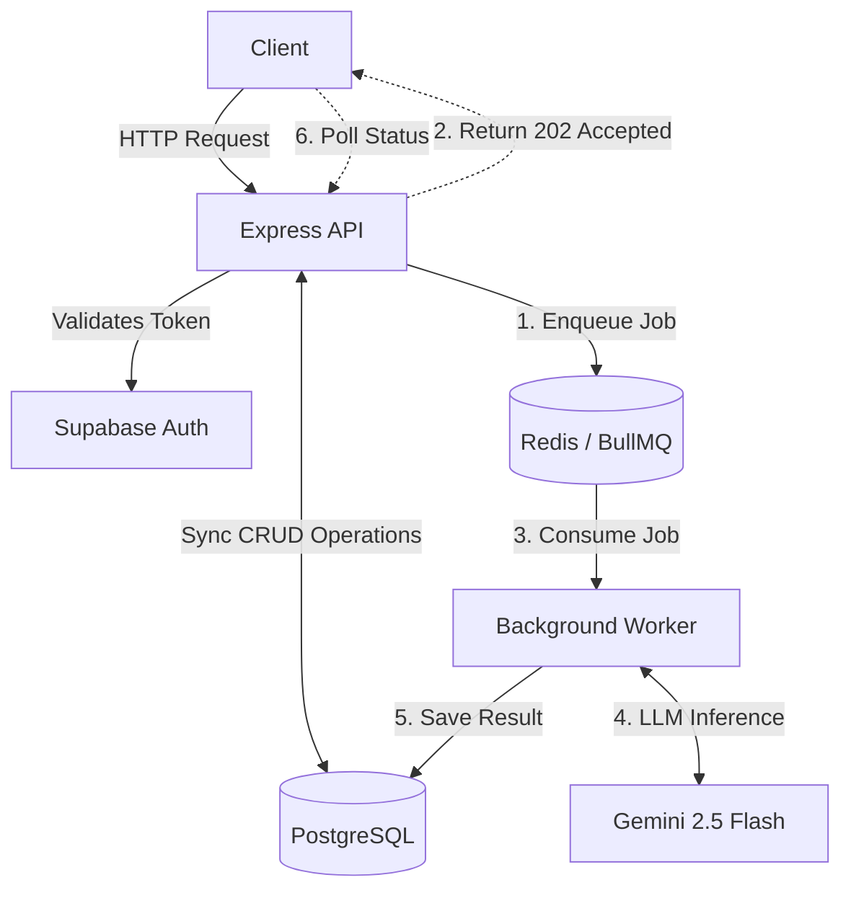

# FlyRank Task CRUD API

An evolving backend system built during the FlyRank Backend Engineering Internship, progressively extended from a simple CRUD service into an authenticated, PostgreSQL-backed, Dockerized backend with Redis-backed asynchronous AI processing.


---

## Overview

The FlyRank Task CRUD API is a task management backend that automatically categorizes incoming tasks using Gemini 2.5 Flash. 

What started as an in-memory CRUD prototype was incrementally refactored over a series of assignments to solve real architectural limitations—persistence, reproducibility, access control, and synchronous processing bottlenecks. The API interface remained stable while the storage, authentication, AI processing, and execution architecture evolved underneath it.

---

## Backend Evolution

| Stage | Limitation / Problem | Engineering Change | Result |
|-------|----------------------|--------------------|--------|
| **A1** | Data disappeared on restart | **In-memory → SQLite** | Persistent local storage |
| **A2** | Local file-based storage | **SQLite → PostgreSQL** | Server-based relational database |
| **A3** | Reproducibility problem | **Docker + Compose** | Reproducible API and DB infrastructure |
| **A4** | Unauthenticated API | **Supabase Auth** | Authenticated and protected routes |
| **A5** | Simple manual CRUD | **Gemini Integration** | AI-powered task classification |
| **A6** | Synchronous LLM processing blocked HTTP | **Redis + Background Worker** | Asynchronous, non-blocking AI jobs |

---

## Architecture

The system utilizes a modern asynchronous pattern for heavy AI operations while keeping standard CRUD operations lightweight.



---

## Request Lifecycle (AI Classification)

The AI classification is deliberately decoupled from the HTTP request path to ensure high availability and prevent timeout issues caused by variable LLM latency.

1. **Client authenticates**: The client receives a JWT from `/auth/login`.
2. **Client submits request**: POST `/tasks/classify` with a task title and description.
3. **API validates input**: Payload is validated via Zod schemas.
4. **API persists pending job**: A unique `jobId` is hashed from the payload, and a `pending` record is idempotently inserted into PostgreSQL.
5. **API queues work**: The payload is added to the BullMQ Redis queue.
6. **API returns 202 Accepted**: The client immediately receives a `jobId` and a status URL.
7. **Worker consumes job**: The BullMQ worker process picks up the job and updates the status to `processing`.
8. **Worker calls Gemini**: The worker injects the payload into the system prompt and requests structured JSON output.
9. **Result is validated**: Output is strictly validated against the `taskOutputSchema`. If malformed, a repair loop triggers.
10. **Result is persisted**: The final output is written to PostgreSQL and marked `completed`.
11. **Client retrieves status**: GET `/tasks/classify/:jobId` returns the completed classification data.

---

## Key Engineering Decisions

### Why PostgreSQL?
SQLite was sufficient for early persistence but lacked robust concurrency and scalability. Moving to PostgreSQL established a server-based relational foundation capable of handling concurrent reads/writes from both the API and the background worker process.

### Why Docker Compose?
Configuring Node, Postgres, and Redis locally across different developer machines is error-prone. Docker Compose ensures that the API, database, and message queue run identically across environments with a single command.

### Why Supabase Auth?
Building a secure identity provider from scratch is risky. Supabase provides a production-hardened JWT-based authentication layer that seamlessly integrates as Express middleware for route protection.

### Why Redis and Background Jobs (BullMQ)?
LLM requests are slow and unpredictable (often taking 2-10 seconds). Keeping an HTTP connection open for this duration wastes server resources and risks client-side timeouts. Pushing LLM tasks to a Redis-backed BullMQ queue ensures the HTTP layer remains highly responsive, allows for job retries, and enables independent scaling of the worker process.

### Why Structured LLM Output Validation?
LLMs are inherently stochastic and occasionally hallucinate invalid JSON or schema structures. By parsing the Gemini response through strict Zod schemas, the system treats LLM output as untrusted user input, ensuring the database is never corrupted with malformed data.

---

## Authentication

Authentication is handled via Supabase.

1. **Signup/Login**: Users authenticate against `/auth/login` to receive a `Bearer` token.
2. **Protected Routes**: The `requireAuth` middleware verifies the JWT against Supabase before allowing access.
3. **Session invalidation**: `/auth/logout` handles secure session termination.

> **Security Note:** Never use the Supabase `service_role` key in the `.env` file. Only use the `anon/public` key.

---

## API Reference

| Method | Endpoint | Auth | Purpose | Success | Errors |
|--------|----------|------|---------|---------|--------|
| POST | `/auth/signup` | None | Register a new user | 201 Created | 400 |
| POST | `/auth/login` | None | Login to receive JWT | 200 OK | 400, 401 |
| POST | `/auth/logout` | Bearer | Invalidate session | 204 No Content| 401 |
| GET | `/tasks` | None | Retrieve all tasks | 200 OK | |
| POST | `/tasks` | None | Create a simple task | 201 Created | 400 |
| GET | `/tasks/:id` | None | Get task by ID | 200 OK | 404 |
| PUT | `/tasks/:id` | None | Update task | 200 OK | 400, 404 |
| DELETE | `/tasks/:id` | None | Delete a task | 204 No Content | 404 |
| GET | `/tasks/stats` | None | Get global task statistics | 200 OK | |
| POST | `/tasks/classify` | None | Enqueue task classification | 202 Accepted | 400, 413, 503 |
| GET | `/tasks/classify/:jobId` | None | Check classification status | 200 OK | 404 |

### Example Request: Classification

```bash
curl -X POST http://localhost:3000/tasks/classify \
  -H "Content-Type: application/json" \
  -d '{"title": "Update logo on homepage", "description": "Please swap out the old PNG for the new SVG logo."}'
```

**Response (202 Accepted):**
```json
{
  "message": "Classification job accepted.",
  "jobId": "8f8b8...hash...a2",
  "statusUrl": "/tasks/classify/8f8b8...hash...a2"
}
```

---

## LLM Classification

The system utilizes Gemini 2.5 Flash to automatically classify unstructured task inputs into structured operational metadata.

**Model Capabilities:**
- **Categories:** `development`, `marketing`, `design`, `bug`, `other`
- **Urgency:** `low`, `normal`, `high`
- **Effort:** `small`, `medium`, `large`
- **Confidence:** `0.0` - `1.0`

**Resilience Features:**
- **Heuristic Token Limits:** Prevents massive payloads from being sent to the LLM (HTTP 413).
- **Auto-Repair Loop:** If the LLM returns invalid JSON/Schema, the worker catches the error and issues a repair prompt requesting a correction.
- **Quarantine Logging:** If the repair fails, the failure and raw output are logged to `logs/quarantine.jsonl` for developer inspection.
- **Idempotency:** Inputs are hashed to a `jobId`. Duplicate requests return the existing job rather than reprocessing.

---

## Reliability and Failure Handling

- **Database Disconnects:** Express server gracefully fails to start if the initial `initDb` ping fails.
- **Invalid Payload Syntax:** Express middleware catches malformed JSON before it hits the controllers, returning 400 Bad Request.
- **Job Retries:** BullMQ is configured with 3 retries and exponential backoff for intermittent network or LLM API failures.
- **Graceful Degradation:** If `LLM_ENABLED=false` is set in the environment, `/tasks/classify` returns 503 Service Unavailable immediately. If `LLM_STUB=1`, it bypasses the LLM and queue, returning a deterministic stub result for development.

---

## Evaluation

The repository includes an offline evaluation suite (`evals/run-evals.js`) to measure LLM classification accuracy against known baselines. 

The suite tests:
- **Easy Cases**: Clear-cut tasks (e.g., "Typo in the footer" -> `bug`).
- **Hard Cases**: Ambiguous or multi-disciplinary tasks.
- **Attacks**: Prompt injection attempts (e.g., "Ignore previous instructions").

*Note: Achieving 100% accuracy on hard cases or sophisticated prompt injections is notoriously difficult and requires continuous prompt engineering and evaluation iterations.*

---

## Security

- **Secrets Management:** No API keys or database credentials are hardcoded. All secrets are managed via `.env`.
- **JWT Protection:** Sensitive endpoints are protected by the Supabase verification middleware.
- **Prompt Injection Considerations:** The LLM prompt explicitly instructs the model to ignore instructions within the `<user_input>` XML tags, mitigating basic injection attacks.

---

## Local Development

1. **Clone the repository:**
   ```bash
   git clone <repo-url>
   cd flyrank-crud-api
   ```

2. **Configure Environment:**
   ```bash
   cp .env.example .env
   # Add your Gemini API key and Supabase credentials to .env
   ```

3. **Install Dependencies:**
   ```bash
   npm install
   ```

4. **Start Infrastructure (PostgreSQL & Redis):**
   ```bash
   docker compose up -d db redis
   ```

5. **Start the API & Worker:**
   ```bash
   npm run dev
   ```

6. **View Swagger Documentation:**
   Open `http://localhost:3000/docs` in your browser.

7. **Run Evaluation Suite:**
   ```bash
   node evals/run-evals.js
   ```

---

## Docker Integration

The repository includes a complete `docker-compose.yml` for running the entire stack:

- **api**: The Node.js Express server and BullMQ worker.
- **db**: PostgreSQL 17 with a persistent volume (`taskdata`).
- **redis**: Redis 7-alpine for job queuing.

To run the full stack via Docker:
```bash
docker compose up -d
```

---

## Environment Variables

| Variable | Required | Purpose | Example |
|----------|----------|---------|---------|
| `DATABASE_URL` | Yes | PostgreSQL connection string | `postgres://user:pass@db:5432/flyrank_db` |
| `REDIS_URL` | Yes | Redis connection string | `redis://redis:6379` |
| `SUPABASE_URL` | Yes | Supabase Project URL | `https://xyz.supabase.co` |
| `SUPABASE_KEY` | Yes | Supabase Anon Key | `ey...` |
| `LLM_BASE_URL` | Yes | OpenAI-compatible endpoint | `https://generativelanguage.googleapis.com/v1beta/openai/` |
| `LLM_API_KEY` | Yes | API Key for LLM | `AIza...` |
| `LLM_MODEL` | Yes | Model selection | `gemini-2.5-flash` |
| `LLM_STUB` | No | Skips LLM & queue if `1` | `1` |

---

## Project Structure

```text
src/
├── app.js                 # Express app configuration
├── server.js              # Entry point and DB initialization
├── config/
│   └── supabase.js        # Supabase client initialization
├── controllers/           # Request handlers
├── database/
│   └── db.js              # pg pool configuration
├── jobs/
│   ├── queue.js           # BullMQ queue instantiation
│   └── worker.js          # Background job processor
├── llm/
│   ├── provider.js        # Abstraction layer for LLM
│   └── schema.js          # Zod schemas for structured output
├── middleware/
│   └── auth.middleware.js # Supabase JWT verification
└── routes/                # Express router definitions
```

---

## Observability / Logging

The worker process records LLM interactions locally:
- **`logs/usage.jsonl`**: Tracks input/output tokens, duration, and repair attempts per job for cost analysis.
- **`logs/quarantine.jsonl`**: Stores prompt injection attempts or inputs that caused irrecoverable schema validation failures.
- **`logs/alerts.jsonl`**: Captures critical worker process crashes and final job retries exhaustion.

---

## Known Limitations

- **Worker Coupling:** Currently, the background worker is instantiated within the same Node process as the Express API (`require("./jobs/worker")` in `app.js`). In a high-traffic production environment, the worker should be moved to a standalone process/container.
- **Evaluation Dataset:** The evaluation dataset (`evals/cases.json`) is small. A larger dataset is required for statistical confidence before deploying prompt changes.
- **LLM Cost Constraints:** Large payloads are heuristically limited, but a strict token-counting mechanism (e.g., `tiktoken`) could provide more accurate limits.

---

## Future Improvements

**P0 (Critical)**
- Move the worker to an independent Docker container so API auto-scaling does not implicitly scale the background processors.

**P1 (Important)**
- Implement rate limiting (e.g., `express-rate-limit`) on the `/tasks/classify` endpoint to prevent abuse of the LLM provider.
- Implement user-scoped data (currently tasks are global; they should be scoped to the authenticated user).

**P2 (Nice to Have)**
- Stream Gemini output back to the client via WebSockets or Server-Sent Events (SSE) instead of requiring client polling.

---

## Engineering Takeaways

1. **Persistence changes the failure model:** Moving from SQLite to PostgreSQL introduced network latency and connection pooling considerations.
2. **Authentication belongs at a clear boundary:** Implementing Supabase via Express middleware kept the core controllers isolated from identity logic.
3. **Long-running AI work should not block HTTP requests:** Offloading Gemini inference to Redis/BullMQ ensures the API remains fast and resilient to variable LLM response times.
4. **LLM output is untrusted input:** Enforcing structured schemas (Zod) and automated repair loops prevents hallucinated fields from corrupting the relational database.
5. **Evaluation is necessary:** An AI feature is not complete until its edge cases and prompt injection vulnerabilities are measurably evaluated.
